# 🔗 Redirect Link Script

포트폴리오 프로젝트 링크들을 나의 도메인으로 리다이렉트하는 nginx 서비스

## ✨ 기준 버전

- **Node.js**: 22.x (ESM)
- **TypeScript**: 5.8.x
- **Docker**: latest
- **GitHub Actions**: v4

## 🎯 프로젝트 목적

포트폴리오에 담을 링크들 (GitHub, Figma, 발표자료 등)을 서버에서 나의 도메인으로 리다이렉트하는 nginx 설정을 자동으로 관리하는 서비스입니다.

## 📂 프로젝트 구조

```
redirect-link-script/
├── 📁 data/
│   └── redirect-links.yml        # 링크 설정 파일
├── 📁 lib/
│   └── parse-yaml-file.ts        # YAML 파싱 유틸
├── 📁 script/
│   └── nginx-config.ts           # nginx 설정 생성 로직
├── 📁 types/
│   └── redirect-link.type.ts     # TypeScript 타입 정의
├── 📄 index.ts                   # 메인 실행 파일
├── 🐳 Dockerfile                 # Docker 이미지 설정
└── 🔄 .github/workflows/ci-cd.yml # GitHub Actions
```

## 🔧 사용법

### 1. 링크 설정

`data/redirect-links.yml` 파일에서 프로젝트별 링크들을 설정:

```yaml
yoi2ttang:
  github:
    url: https://github.com/pcjo1202/Yoi2ttang
  figma:
    url: https://www.figma.com/design/cyFhMWzGuFbeLrX3nsjyvz/...
  presentation:
    url: https://www.canva.com/design/DAGsBgcWL9E/...

IEUM:
  github:
    url: https://github.com/pcjo1202/IEUM
  figma:
    url: https://www.figma.com/design/yQxkEF8exrcaOX2usmbLAU/...
  presentation:
    url: https://www.canva.com/design/DAGkGpHLyco/...
```

### 2. 로컬 실행

```bash
# 의존성 설치
pnpm install

# nginx 설정 파일 생성
pnpm generate

# Docker 빌드 및 실행
docker build -t redirect-links .
docker run -p 8080:80 redirect-links
```

### 3. 리다이렉트 URL 접근

- `/{프로젝트명}/{링크타입}` → 해당 URL로 301 리다이렉트
- 예시:
  - `/yoi2ttang/github` → GitHub 저장소로 이동
  - `/IEUM/figma` → Figma 디자인으로 이동
  - `/SSACLE/presentation` → 발표자료로 이동

## 🚀 CI/CD 파이프라인

### 자동 배포 트리거

- `main` 브랜치에 Push할 때
- 수동 실행 (`workflow_dispatch`)

### 배포 단계

```mermaid
graph LR
    A[코드 Push] --> B[체크아웃]
    B --> C[pnpm 설치]
    C --> D[Node.js 설정]
    D --> E[의존성 설치]
    E --> F[nginx.conf 생성]
    F --> G[GHCR 로그인]
    G --> H[Docker 빌드]
    H --> I[이미지 푸시]
    I --> J[서버 배포]
    J --> K[배포 확인]
```



#### 1️⃣ **빌드 단계**

```yaml
- name: 의존성 설치 및 nginx.conf 생성
  run: |
    pnpm install --frozen-lockfile
    pnpm generate
```

#### 2️⃣ **이미지 빌드 & 푸시**

```yaml
- name: 이미지 빌드 및 푸시
  run: |
    IMAGE_NAME="ghcr.io/${{ github.repository }}/nginx-app:${{ github.sha }}"
    docker build -t $IMAGE_NAME .
    docker push $IMAGE_NAME
```

#### 3️⃣ **서버 배포**

```yaml
- name: 서버 배포
  run: |
    # 이전 컨테이너 정리
    docker stop nginx-redirect || true
    docker rm nginx-redirect || true

    # 새 이미지 배포
    docker pull ${{ env.IMAGE_NAME }}
    docker run -d --name nginx-redirect -p 80:80 ${{ env.IMAGE_NAME }}
```

### 배포 환경 설정

GitHub Repository Settings에서 다음 Secrets 설정 필요:

```bash
ORACLE_SERVER_IP       # 서버 IP 주소
ORACLE_SERVER_USERNAME # 서버 사용자명
ORACLE_SERVER_KEY      # SSH 개인키
```

### 배포 확인

배포 후 자동으로 다음을 확인:

- 컨테이너 실행 상태
- nginx 서비스 동작 여부
- 포트 바인딩 확인

## 🐳 Docker 사용

```bash
# GitHub Container Registry에서 가져오기
docker pull ghcr.io/{username}/redirect-link-script:latest

# 컨테이너 실행
docker run -d -p 80:80 ghcr.io/{username}/redirect-link-script:latest
```

## 💻 개발 가이드

### 새 프로젝트 링크 추가

1. `data/redirect-links.yml`에 새 프로젝트 추가
2. Git에 커밋/푸시
3. GitHub Actions가 자동으로 배포

### 타입 정의

```typescript
interface RedirectLinkData {
  topic: string;
  links: Record<string, { url: string }>;
}
```

## 📋 주요 스크립트

- `pnpm generate`: nginx.conf 파일 생성
- `pnpm dev`: 개발 모드 실행
- `pnpm build`: TypeScript 빌드

---

**간단하고 효율적인 포트폴리오 링크 관리 시스템** 🎯
